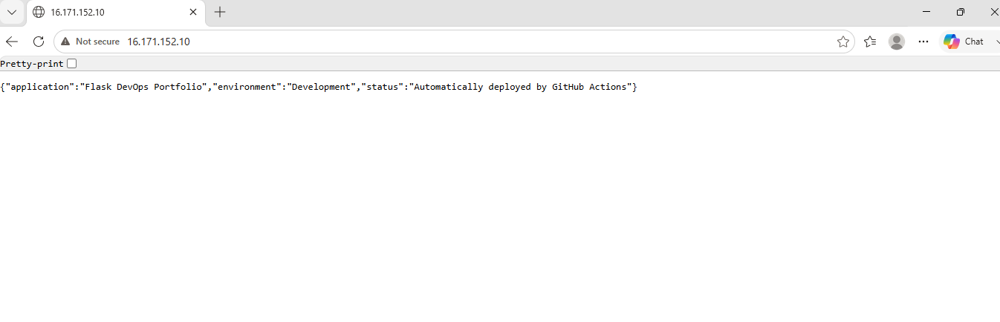
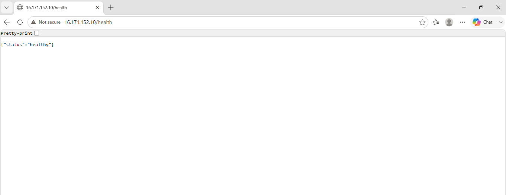
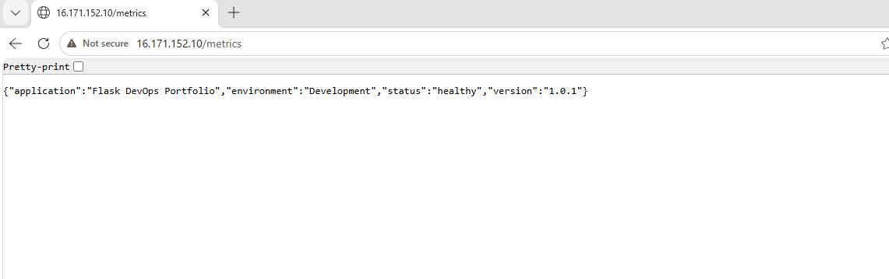
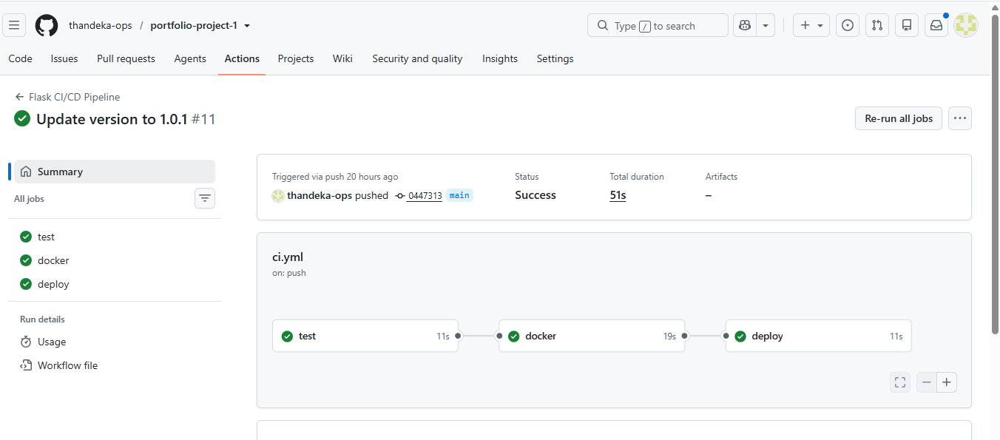
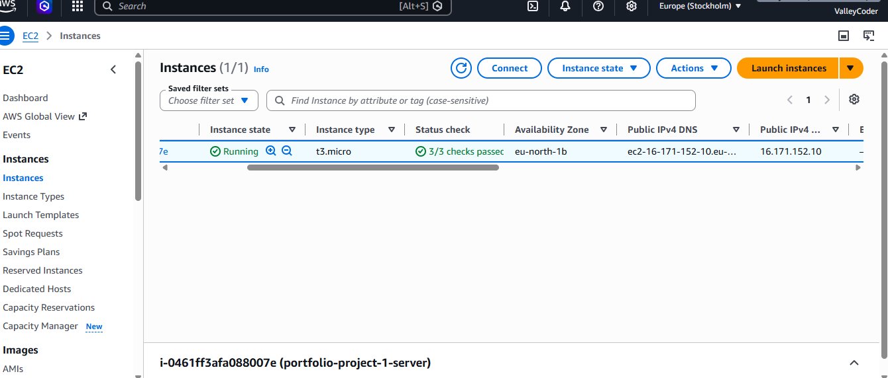

# 🚀 Flask DevOps Portfolio Project

## Overview

This project demonstrates a complete DevOps CI/CD pipeline using:

- Python
- Flask
- Docker
- GitHub Actions
- Docker Hub
- AWS EC2
- Linux

Every push to the **main** branch automatically:

- ✅ Runs unit tests
- ✅ Builds a Docker image
- ✅ Pushes the image to Docker Hub
- ✅ Deploys the latest version to AWS EC2

---

# Architecture

```
Developer
     │
     ▼
 GitHub Repository
     │
     ▼
 GitHub Actions
     │
     ├── Run Tests
     ├── Build Docker Image
     ├── Push Docker Hub
     ▼
 AWS EC2
     │
     ▼
 Docker Container
     │
     ▼
 Flask API
```

---

# Technologies

- Python
- Flask
- Docker
- Docker Compose
- Git
- GitHub Actions
- Docker Hub
- AWS EC2
- Ubuntu Linux
- Pytest

---

# API Endpoints

| Endpoint | Description |
|-----------|-------------|
| `/` | Home |
| `/health` | Health Check |
| `/version` | Version |
| `/metrics` | Application Metrics |

---

# Screenshots

## Home



---

## Health Endpoint



---

## Metrics Endpoint



---

## GitHub Actions Pipeline



---

## AWS EC2 Deployment



---

# Run Locally

Clone the repository

```bash
git clone https://github.com/thandeka-ops/portfolio-project-1.git
```

Install dependencies

```bash
pip install -r app/requirements.txt
```

Run locally

```bash
python app/app.py
```

Run with Docker

```bash
docker compose up --build
```

---

# Docker Hub

Image

```
tholiwe/portfolio-project-1:latest
```

---

# CI/CD Pipeline

Every push to **main** automatically:

- Run unit tests
- Build Docker image
- Push Docker image
- Deploy to AWS EC2

---

# Author

**Tholiwe Mchunu**

Aspiring DevOps Engineer

GitHub:

https://github.com/thandeka-ops